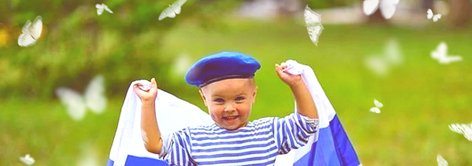

# Человек системного бизнеса

Я считаю что природа это робот, только биологического формата, работающего по физическим законам. 

> И человеку в природе не место, хотя бы потому, что природе безразлична наша чакральная система, и она никак не может помочь нам её развивать. А у нас кроме чакр, ничего и примечательного то и нет. 

Нам нужны государства, железные джунгли, которые будут реагировать на наши внутренние инструменты. 


### Кто я

При исследованиях человека многими учёными мужами, было зафиксировано, что у человека есть как душа, так и дух. Я же подметил, что душа это работа нижних чакр, а дух это работа верхних чакр тела. И есть ещё одна чакра, у которой функция регуляции взаимотношений души одного тела, с духом другого тела.

Вы наверно слышали "береги честь с молоду", я так же добавлю, что достоинство тоже надо беречь. В детстве у нас чакры работают в превосходном состоянии, или скорее даже необходимом, их то и надо беречь, иначе будет беда.


Человек может находится лишь в одной определённой чакре, мужчина на чакрах духа и достоинства, а женщина на чакрах души и чести. В зависимости от положения чакры, тело вырабатывает определённые состояния необходимые для определённой деятельности:

```diff
1. Регулятор манипура = состояние обояния
  1.1. Дух сахасрара = состояние мудрости
      1.1.1. Достоинство аджна = состояние победоносности 
      1.1.2. Достоинство вишуддха = состояние восхищения 
  1.2. Душа анахата = состояние памяти
      1.2.1. Честь свадхистхана = состояние непоколебимости
      1.2.2. Честь муладхара = состояние безмятежности
```

### Кураторы

Наше тело не просто так на солнышке любит грется, на парашуте спускаться, в море купаться, в земле копаться. Это нас кормит, кормит нашу чакру, в которой мы на тот момент находимся. 


У галактики много кураторов, но для человечества утверждены четыре, которые вступают с нами в контакт с помощью унисона:
1. Унисон романтики = куратор Солнце
2. Унисон безжалостности = куратор Воздух
3. Унисон искренности = куратор Вода
4. Унисон спокойствия = куратор Земля

### Две половинки

На чакру регулятора человеку в одного не выйти, даже не так, её можно пробудить с помощью сплетения души одного тела с духом другого тела. 


