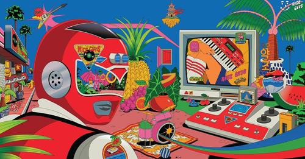
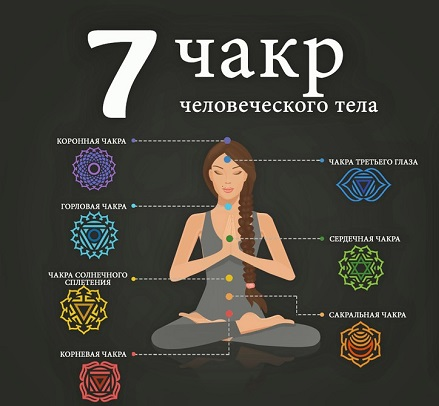
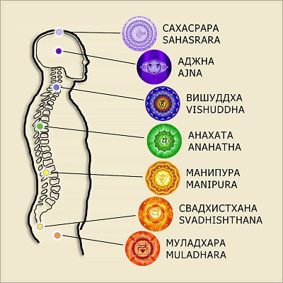
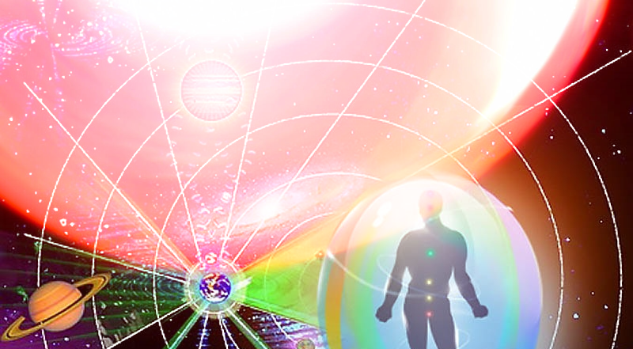

# Человек свободы

Я считаю что природа это робот, только биологического формата, работающего по физическим законам. 

> И человеку в природе не место, хотя бы потому, что природе безразлична наша чакральная система, и она никак не может помочь нам её развивать. А у нас кроме чакр, ничего  примечательного то и нет. 

Нам нужны государства, железные джунгли, которые будут реагировать на наши внутренние инструменты. 



### Человек

При исследованиях человека многими учёными мужами, было зафиксировано, что у человека есть как душа, так и дух. Я же подметил, что душа это работа нижних чакр, а дух это работа верхних чакр тела. Так же подметил что есть ещё независимая чакра у которой функция регуляции взаимотношений души одного тела с духом другого тела.



И вы наверно слышали "береги честь с молоду", я так же добавлю, что достоинство тоже надо беречь. В детстве у нас чакры работают в превосходном состоянии, или скорее даже необходимом, их то и надо беречь, иначе будет беда.



Человек может находится лишь в одной определённой чакре, мужчина на чакрах духа и достоинства, а женщина на чакрах души и чести. В зависимости от положения чакры, тело вырабатывает базовые состояния необходимые для первостепенной деятельности:

```diff
1. Регулятор манипура = состояние обояния
  1.1. Дух сахасрара = состояние мудрости
      1.1.1. Достоинство аджна = состояние победоносности 
      1.1.2. Достоинство вишуддха = состояние восхищения 
  1.2. Душа анахата = состояние памяти
      1.2.1. Честь муладхара = состояние непоколебимости
      1.2.2. Честь свадхистхана = состояние безмятежности
```

При этом чтобы дух заработал, нужно два достоинства привести в рабочее состояние. 
А чтобы душа заработала, нужно привести в рабочее состояние соотвественно две чести.

p.s.1. Заметил что сейчас почему то некоторые мужчины опускаются до нижних чакр, а женщины поднимаются на верхние... что не соотвествует заложенным в тело функциям, видимо это какая то давняя недоработка наших создателей. Мужчине нужно работать на верхних чакрах, а женщине только на нижних. Она же всё таки должна следить за родами и содержать дом в чистоте, а не он.

p.s.2. Чтобы прийти в себя мужчине нужно принять актитропил, а женщине пенталгин.

p.s.3. Если вы не занимались какой то чакрой, то она находится на фазе зарождения. И желательно чтобы для мужчины чакры души, а для женщины чакры духа, так и оставались на этой фазе зарождения. Если же у вас произошло развитие несвойственных вашему полу чакр, их можно вернуть в первоначальную с помощью аннигиляции.

### Кураторы

Наше тело не просто так на солнышке любит греться, на парашуте спускаться, в море купаться, в земле копаться. Это нас кормит, кормит нашу чакру, в которой мы на тот момент находимся. 



У галактики много кураторов, но для человечества утверждены четыре (как и природе), которые вступают с нами в контакт с помощью унисона:
1. Унисон романтики = куратор Солнце
2. Унисон справедливости = куратор Воздух
3. Унисон искренности = куратор Вода
4. Унисон спокойствия = куратор Земля

Унисон это считывание вибраций кураторов, нарабатывается практиками и различными взаимодействиями. Чем больше уровень считывания, тем сильнее (или мощнее) чакра может заряжаться и в дальнейшем шире проявлять себя.

### Государство

На чакру регулятора человеку в одного не выйти, даже не так, её можно пробудить с помощью сплетения души одного тела с духом другого тела. Достоинства и честь тут не помощники. Только сплетение духа и души образует парное состояние способное создать государство, или способное вносить вклад в культуру государства, если государство уже было кем то создано. У духа мужчины при этом обязаность вносить вклад в виде преданности, а у души женщины вносить вклад в виде самоотдачи. Ну тут так же подмечу, если мужчина в духе, а женщина в душе.


Практическим путём наших предков были выявлены четыре стадии культуры у государства, религии или опг:
1. Культура жизни, золотой век = 60%-100% свободы, 0%-40% неприкаянности
2. Культура выживания, серебрянный век = 50%-60% свободы, 40%-50% неприкаянности
3. Культура доживания, железный век = 10%-50% свободы, 50%-90% неприкаянности
4. Культура отживания, титановый век = 0%-10% свободы, 90%-100% неприкаянности

Такие знания в дальнейшем выстроили иерархию должностей, где пара, что была способна максимально культурно жить, ставилась во главу государства. Такое обустройство в дальнейшем начало стимулировать молодых искать свою неповторимую половинку, преданность с которой достигло бы золотого века. Хотя я предполагаю, что для каждого мужчины рождается истиная половинка, где то недалеко. Я свою истинную нашёл, назвал бы совместимость как "кровь от крови", с ней я только свободен по настоящему, с другими тоже хорошо, но они вгоняли в блаженную лень, то есть я не понимал чётко чем заниматься и впадал в неприкаянность.

Деньги это регулятор государства (религии, опг) и даются за вклад преданности (или самоотдачи) в нужное место культуры. Иуды же зарабатывают воровством и всегда вкладываются в ненужные места культуры.

### Перспективы

Что ещё нужно, как попробовать иное?, выйти из базовых состояний, познать своё мастерство? Вот карта состояний с музыкальным сопровождением и красотой:

```diff
1. Регулятор манипура
   1.1. Унисон романтики
        1.1.1. Культура жизни = парное состояние сказочности
               🎼 Jenya Giga - Романтик
               💐 Роза
        1.1.2. Культура выживания = парное состояние одиночества
               🎼 SNEЖNO - Дэнди
               💐 Ваниль
        1.1.3. Культура доживания = парное состояние безразличия
               🎼 Mia Rodriguez - Psycho
               💐 Нарцисс
        1.1.4. Культура отживания = парное состояние хаоса
               🎼 ALIB - А я летаю
               💐 Ликорис
   1.2. Унисон справедливости
        1.2.1. Культура жизни = парное состояние отваги
               🎼 ГИО ПИКА feat. SH KERA - Владикавказ - Наш Город
        1.2.2. Культура выживания = парное состояние замкнутости
               🎼 мц горемыка - не трогал твою даму
        1.2.3. Культура доживания = парное состояние пофигизма
               🎼 Elliot Lee - Drama Queen
        1.2.4. Культура отживания = парное состояние захватов
               🎼 Tyga - Taste ft. Offset
   1.3. Унисон искренности
        1.3.1. Культура жизни = парное состояние красоты
               🎼 Enjoykin — Алло, Кисунь
        1.3.2. Культура выживания = парное состояние секретов
               🎼 Tessa Violet - Crush
        1.3.3. Культура доживания = парное состояние непоняток
               🎼 Emotion - Mia Rodriguez
        1.3.4. Культура отживания = парное состояние обезображивания
               🎼 Madonna - Frozen
   1.4. Унисон спокойствия
        1.4.1. Культура жизни = парное состояние целостности
               🎼 Каспийский груз - Доедешь-пиши
        1.4.2. Культура выживания = парное состояние наслаждения
               🎼 Doja Cat - Bottom Bitch
        1.4.3. Культура доживания = парное состояние шута
               🎼 TOMMY CASH - RACKED
        1.4.4. Культура отживания = парное состояние ненужности
               🎼 Александр Лаэртский – Вымирание племени
```

```diff
2. Дух сахасрара
   2.1. Унисон романтики
        2.1.1. Преданность жизни = состояние раслабления
               🎼 Enjoykin — Писюн Писюн (feat. Ник Черников)
               🎼 Иванушки Int. - Тополиный пух
               🎼 Мумий тролль - непокой
        2.1.2. Преданность выживания = состояние крайности
               🎼 2rbina 2rista - Шестая Палата
               🎼 Enjoykin — Житие Мое
               🎼 Enjoykin — Космос Будет Наш
        2.1.3. Преданность доживания = состояние неопределенности
               🎼 Игорь Саруханов - Ты попала
        2.1.4. Преданность отживания = состояние обвинения
               🎼 Агата Кристи - Секрет
   2.2. Унисон справедливости
        2.2.1. Преданность жизни = состояние позволения
               🎼 Enjoykin — Не унывайте, пацаны
               🎼 Короли ночной Вероны
        2.2.2. Преданность выживания = состояние отталкивания
               🎼 DeCord - Без Жалости
               🎼 Enjoykin — Обращение к Дагестанцам
               🎼 Подъем! - Белые кораблики
        2.2.3. Преданность доживания = состояние внедрения
               🎼 The Prodigy - Breathe
               🎼 Четвёртое Измерение - Фатальность
        2.2.4. Преданность отживания = состояние презрения
               🎼 Тони Раут x Ivan Reys - Танцуй на костях
   2.3. Унисон искренности
        2.3.1. Преданность жизни = состояние постоянности
               🎼 Enjoykin — Лайки Крутятся (feat. Сергей Дружко)
        2.3.2. Преданность выживания = состояние проталкивания
               🎼 Mind Brand (Cover by Sati Akura)
               🎼 Ани Лорак - Мы нарушаем
        2.3.3. Преданность доживания = состояние ?
        2.3.4. Преданность отживания = состояние ?
   2.4. Унисон спокойствия
        2.4.1. Преданность жизни = состояние гостеприимства
               🎼 Бременские музыканты - ничего на свете лучше нету
               🎼 Пикник – Всё Перевернётся
        2.4.2. Преданность выживания = состояние непривязанности
               🎼 ТУ-134 – Память папы
        2.4.3. Преданность доживания = состояние отрешённости
               🎼 Courtney Barnett - Before You Gotta Go
        2.4.4. Преданность отживания = состояние потерянности
               🎼 Walkie - Не на той стороне
```

```diff
3. Достоинство аджна
   3.1. Унисон романтики
        3.1.1. Преданность жизни = состояние приколиста
               🎼 55Х55-МУЗЫКА НЕ МУЗЫКАНТА 2 (feat. Snailkick)
               🎼 David Garrett - Viva La Vida - YouTube
               🎼 СерьГа - А что нам надо
        3.1.2. Преданность выживания = состояние понимания
               🎼 Enjoykin — Я Просто Устала (feat. Марьяна Ро)
        3.1.3. Преданность доживания = состояние ?
        3.1.4. Преданность отживания = состояние ?
   3.2. Унисон справедливости
        3.2.1. Преданность жизни = состояние свояка
               🎼 Enjoykin — Брат
               🎼 Shantel - DISKO PARTIZANI
               🎼 Невидимка – Звезда
        3.2.2. Преданность выживания = состояние отстаивания
               🎼 Butterfly Temple - Бегу я рысью, бегу я волком
               🎼 Коста Лакоста - Алые Водопады
               🎼 Денис Майданов - ВДВ
               🎼 Каста — Вокруг шум
               🎼 Ногу Свело! - Наши юные смешные голоса
        3.2.3. Преданность доживания = состояние пренебрежения
               🎼 55x55 – СОЛОВЬЁБ
               🎼 CADILLAC - GAME OVER
               🎼 Enjoykin - Стартуем
               🎼 Ploho - Пустота
        3.2.4. Преданность отживания = состояние давления
               🎼 9 Грамм - Ласковый зверь (при уч.Alina Orlova)
               🎼 Enjoykin - Братишка
               🎼 Grimwind - Галактика В Огне
               🎼 Без Поводка – Моя злость
               🎼 Оу74 – Кушать подано
               🎼 Путь Солнца - Руби
   3.3. Унисон искренности
        3.3.1. Преданность жизни = состояние верности
               🎼 Arcangel - Mi Testimonio
        3.3.2. Преданность выживания = состояние насмешек
               🎼 Java - J'me marre
        3.3.3. Преданность доживания = состояние скромности
               🎼 Хули ты ноешь (Гимн свадебных работников, Камызяки cover)
        3.3.4. Преданность отживания = состояние болвана
               🎼 Enjoykin — Зато я спас кота (feat. Ник Черников)
   3.4. Унисон спокойствия
        3.4.1. Преданность жизни = состояние праздника
               🎼 National Youth Choir of Namibia - Endeni
        3.4.2. Преданность выживания = состояние ?
        3.4.3. Преданность доживания = состояние безразличия
               🎼 не наркоманы а растаманы мы
        3.4.4. Преданность отживания = состояние мошенничества
               🎼 GYPSY FOR ONE DAY - La CARAVANE PASSE feat. ERIKA SERRE
```

```diff
4. Достоинство вишуддха
   4.1. Унисон романтики
        4.1.1. Преданность жизни = состояние присутствия
               🎼 Imany - You will never know
               🎼 Егор Летов - ЭЛЕКТРИЧЕСКИЙ ПЁС
        4.1.2. Преданность выживания = состояние вдохновения
               🎼 Алексей Хворостян - Падали, но поднимались
               🎼 МЫ - Зима
        4.1.3. Преданность доживания = состояние ?
        4.1.4. Преданность отживания = состояние брожения
               🎼 Enjoykin — Скайрим
   4.2. Унисон справедливости
        4.2.1. Преданность жизни = состояние результата
               🎼 Marc Anthony - Flor Pálida
               🎼 Дискотека Авария — Небо
        4.2.2. Преданность выживания = состояние напряжения
               🎼 Empire Of The Sun - We Are The People
               🎼 СПЛИН - Романс
        4.2.3. Преданность доживания = состояние невыполнения
               🎼 Enjoykin — Жить По-Пацански
        4.2.4. Преданность отживания = состояние свинства
               🎼 Enjoykin - Безысходность
   4.3. Унисон искренности
        4.3.1. Преданность жизни = состояние ясности
               🎼 55x55 – СЦЕНАРИСТ (feat. BadComedian)
               🎼 Enjoykin — Котлетки с Пюрешкой
        4.3.2. Преданность выживания = состояние чёткости
               🎼 Enjoykin — Нецветные Розы (feat. Диана Шурыгина)
               🎼 One T - I Woke Up
        4.3.3. Преданность доживания = состояние беспросветности
               🎼 Enjoykin — Завтрашний День (feat. Виталий Кличко)
               🎼 Enjoykin — К Полету Готов
               🎼 Многоточие - Дыши
        4.3.4. Преданность отживания = состояние застоя
               🎼 Enjoykin — Дорогие Юные Друзья
   4.4. Унисон спокойствия 
        4.4.1. Преданность жизни = состояние разрешений
               🎼 Devendra Banhart - Carmensita
               🎼 Максим Леонидов и ХиппоБэнд - Волки
        4.4.2. Преданность выживания = состояние бойкости
               🎼 Как жили мы борясь - Не бойся я с тобой
        4.4.3. Преданность доживания = состояние ?
        4.4.4. Преданность отживания = состояние запоздалости
```

```diff
5. Душа анахата
   5.1. Унисон романтики
        5.1.1. Самоотдача жизни = состояние дома
               🎼 Ava Max - Come Home
               🎼 Demo - Нежность
               🎼 Sufjan Stevens & Angelo De Augustine - Lady Macbeth In Chains
               🎼 Машина времени - пока горит свеча
               🎼 LINDEMANN - Praise Abort
        5.1.2. Самоотдача выживания = состояние благословления
               🎼 Celestial Healing Harmony
               🎼 Enjoykin - Группа Крови
               🎼 LOBODA — Твои Глаза
               🎼 Ляпис Трубецкой - Путинарода
               🎼 Павел Кашин - Город
        5.1.3. Самоотдача доживания = состояние ?
        5.1.4. Самоотдача отживания = состояние безысходности
               🎼 Enjoykin - Пацан к успеху шел
               🎼 Стальной дракон - Безысходность
   5.2. Унисон справедливости
        5.2.1. Самоотдача жизни = состояние сопровождения
               🎼 Калинов мост - Родная
        5.2.2. Самоотдача выживания = состояние наблюдения
               🎼 Enjoykin - Полковник
        5.2.3. Самоотдача доживания = состояние наступления
               🎼 Сплин - Линия Жизни
        5.2.4. Самоотдача отживания = состояние ?
   5.3. Унисон искренности
        5.3.1. Самоотдача жизни = состояние последушки
               🎼 Erasure - Breathe
        5.3.2. Самоотдача выживания = состояние суверенитета
               🎼 izzamuzzic - ice
        5.3.3. Самоотдача доживания = состояние ?
        5.3.4. Самоотдача отживания = состояние дуры
   5.4. Унисон спокойствия
        5.4.1. Самоотдача жизни = состояние чистоты
               🎼 Enjoykin — Москва - Ленинград
        5.4.2. Самоотдача выживания = состояние предостережений
               🎼 IC3PEAK - Плак-Плак
        5.4.3. Самоотдача доживания = состояние вредных советов
               🎼 La Caravane Passe (feat. R.Wan) - ZINZIN MORETTO 
        5.4.4. Самоотдача отживания = состояние лжи
               🎼 Enjoykin — From My Heart (feat. Виталий Мутко)
```

```diff
6. Честь муладхара
   6.1. Унисон романтики
        6.1.1. Самоотдача жизни = состояние гостеприимства
               🎼 Julien Doré - Kiss Me Forever
        6.1.2. Самоотдача выживания = состояние независимости
        6.1.3. Самоотдача доживания = состояние шмары
        6.1.4. Самоотдача отживания = состояние раставаний
               🎼 Света – А ты не мой
   6.2. Унисон справедливости
        6.2.1. Самоотдача жизни = состояние потребностей
               🎼 Свидание - Я и твой кот
        6.2.2. Самоотдача выживания = состояние лучшего
               🎼 GroTTesque - Стальное Сердце
               🎼 El Alfa - Mera Woo
        6.2.3. Самоотдача доживания = состояние балбеса
               🎼 Enjoykin — Nyash Myash
        6.2.4. Самоотдача отживания = состояние неразборчивости
               🎼 Enjoykin - Crazy Midnight Display
   6.3. Унисон искренности
        6.3.1. Самоотдача жизни = состояние воспоминаний
               🎼 Смысловые Галлюцинации - Волшебный Мир
        6.3.2. Самоотдача выживания = состояние отвлечения
               🎼 Альянс - На заре
        6.3.3. Самоотдача доживания = состояние ?
        6.3.4. Самоотдача отживания = состояние ?
   6.4. Унисон спокойствия
        6.4.1. Самоотдача жизни = состояние требований
               🎼 Soviet Suprem - Bolchoï
               🎼 Цой - Весь мир идет на меня войной
        6.4.2. Самоотдача выживания = состояние подмечания
               🎼 Enjoykin - Семечки
        6.4.3. Самоотдача доживания = состояние ?
        6.4.4. Самоотдача отживания = состояние попадалова
               🎼 Enjoykin - Мухи
               🎼 КУРАРА - КУРАРА ЧИБАНА
```

```diff
7. Честь свадхистхана
   7.1. Унисон романтики
        7.1.1. Самоотдача жизни = состояние дела
               🎼 Невиди́мка — Звезда
        7.1.2. Самоотдача выживания = состояние задумчивости
               🎼 Небо Пополам - Весна
        7.1.3. Самоотдача доживания = состояние ?
        7.1.4. Самоотдача отживания = состояние отлынивания
               🎼 Гриша - А я укуренный иду по переулочку
   7.2. Унисон справедливости
        7.2.1. Самоотдача жизни = состояние почтения
               🎼 Enjoykin — Ламповая Няша
               🎼 MOON FAR AWAY - Velichalnaya
        7.2.2. Самоотдача выживания = состояние ?
        7.2.3. Самоотдача доживания = состояние небрежности
               🎼 Би-2 - Держаться за воздух
        7.2.4. Самоотдача отживания = состояние изгнания
               🎼 REDO - АЛГОРИТМЫ
   7.3. Унисон искренности
        7.3.1. Самоотдача жизни = состояние заинтересованности
               🎼 Enjoykin — Привет! Как Дела
        7.3.2. Самоотдача выживания = состояние приятельства
               🎼 Аквариум - Марш Священных Коров
        7.3.3. Самоотдача доживания = состояние надежд
               🎼 Enjoykin — Офицер
        7.3.4. Самоотдача отживания = состояние ужаса
               🎼 Marilyn Manson - Tainted Love
   7.4. Унисон спокойствия
        7.4.1. Самоотдача жизни = состояние доверия
               🎼 Вася Обломов - Жизнь налаживается
               🎼 La Caravane Passe - Nomadic Spirit ft. Mehdi Nassouli
               🎼 Stupeflip - The Solution
        7.4.2. Самоотдача выживания = состояние изящества
               🎼 Gorillaz - Stylo
        7.4.3. Самоотдача доживания = состояние обломов
               🎼 Сидоджи Дубоshit и Грязный Рамирес - Джин Grey
        7.4.4. Самоотдача отживания = состояние растяпы
               🎼 HAZИМА & Валерия – Тысячи историй
               🎼 Jason Derulo - Tip Toe feat. French Montana
               
```
