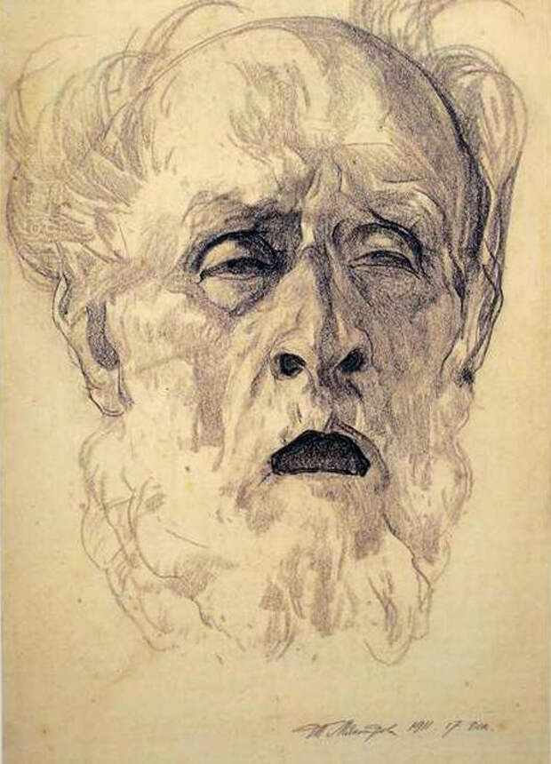
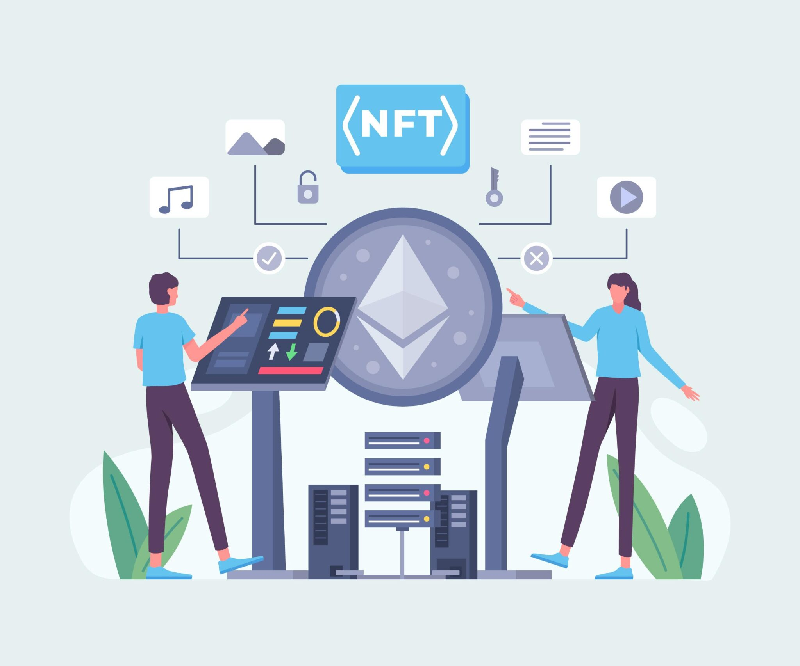
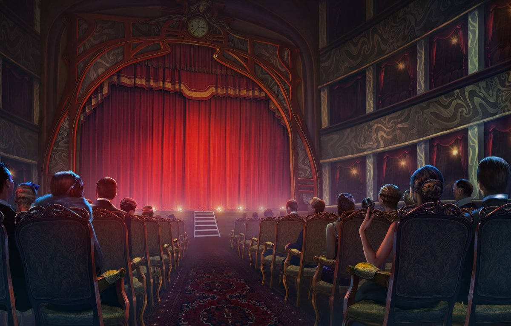

# Благоразумное благополучие

Природа это робот, только биологического формата, работающего строго по физическим законам. 

И человеку в природе не место, хотя бы потому, что природе безразлична наша чакральная система, и она никак не может помочь нам её развивать. А у нас кроме чакр, ничего примечательного то и нет. 

> Мы утеряли семейные узы и обрели идею.

Нам нужны государства, железные джунгли, которые будут реагировать на наши внутренние инструменты для парной жизни. Ведь нам надо опираться на слово "мы".

Я послойно воссоздам деликатность и практичность, необходимые для выживания, как для женского тела, так и мужского. 

---------------------------

### Проект "Иное понимание капитализма"

Капитализм строился с главной общей целью: как сделать так, чтобы продукты которые вы производите - не пропали даром. 

### Потребность

В начале пути к капитализму вы окажетесь один на один с самым главным врагом капитализма - это дармоедство. Если кто то что то тебе подарил на день рождение, то дармоедство может прийти и это забрать, ну потому что посчитала что тебе этого не нужно. 

Дармоедство может образоваться и в хорошо слаженном бизнессе, когда одни желания начинают накладываться на другие, что анти-сводит всю деятельность к соперничеству работодателя с работником. Итогом у обоих будут - упущенные возможности, которые будут последовательно подходить к 100%.

### Стимул

Сейчас в криптовалюте появился NFT, если перевести на русский то это электронная купюра, закреплённая за каким то человеком, находящемся в блокчейн-системе. Блокчейн-система же это история всех регистраций пользователей, операций перевода, которые нужно каждому пользователю хранить у себя в отдельности (повышает спрос не только на видеокарты, но и жёсткие диски). 

NFT прежде чем иметь виртуальную ценность продаётся за реальные деньги. То есть и это не смогло заменить реальные деньги (в точности как и карточки не заменили наличку). Попробуем поправить идею "виртуальная купюра", сохранив блокчейн децентрализацию (где одна история на всех).

Собственно обратимся напрямую к рынку. Есть товар и "виртуальная купюра" должна его забрать. Что мы делаем когда хотим продать машину? Фотаем и вылаживаем на барахолку. Когда появляется конкуренция, то обращаемся в рекламный отдел, он оформляет "уникальность", что делает товар более привлекательным (не такой как у всех). Собственно попробуем вложить в виртуальную купюру идею "не такой как у всех".

Первое что приходит на ум, это "быстрота отдачи", в простонародье кредит. То есть человек, имеющий товар, приглашает nft-специалиста который создаёт на этот товар виртуальную купюру с какой то ценностью (цифровой стоимости согласно каким то правилам). То есть в дальнейшем продавец вместе с товаром отдаёт виртуальную купюру (или наоборот, виртуальную купюру показывает покупатель как билет), при этом у продавца списываются долги с виртульных купюр которые он набрал сам. Собственно продавцу не будет выгодно, если у него не будет взятых виртуальных купюр с которых можно будет списать стоимость.

Вместо товара может быть и услуга.

Тут можно в дальнейшем подумать над нациализацией таких денег, так как это более стабильная и открытая модель, где государство может брать % ндфл на самом этапе создании виртуальной купюры. А пока можно сделать деньги как товар, со стоимостью 1 к 1.

### Расшевелить недвижимость

Всё вокруг можно воспринимать как недвижимость. С помощью денег мы научились это превращать в наши инструменты. Чтобы бы мы не делали с помощью денег, всё будет игра. Зарабатывая деньги, мы надеемся на то, что получим в итоге "свою нужность миру". Но если не впустить в себя ИГРУ, ты не получишь деньги. Получит кто то другой, кто впустил. Так деньги оседают у кого то другого, порождая недвижимость, а у того кто не получил - отсутствие игры. И недвижимость перестала быть инструментом... а может быть потому, что деньги нужно было вручить кому то другому, более компетентному?

