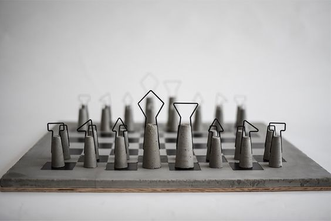
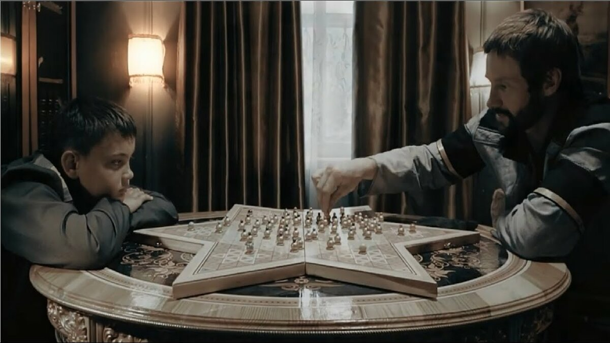
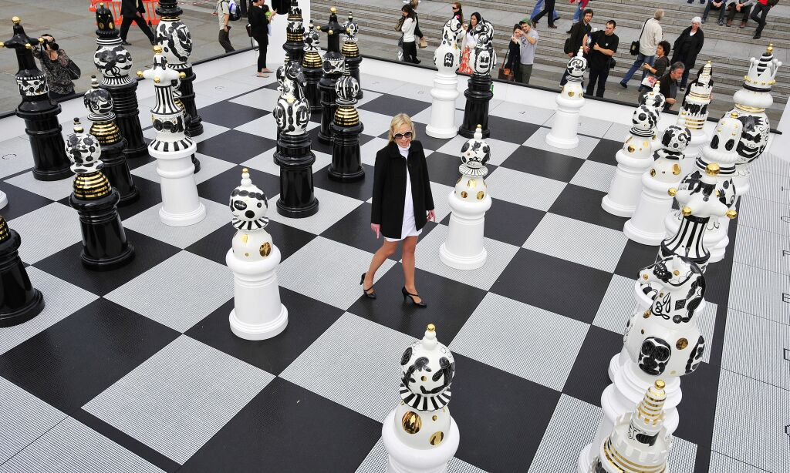
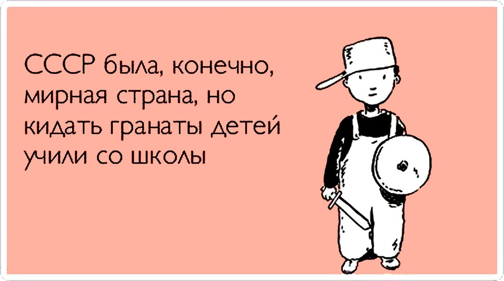
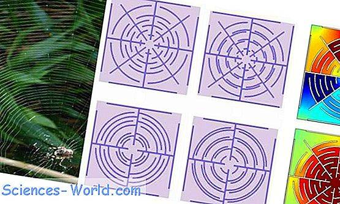

# Благоразумное благополучие

Природа это робот, только биологического формата, работающего строго по физическим законам. 

И человеку в природе не место, хотя бы потому, что природе безразлична наша чакральная система, и она никак не может помочь нам её развивать. А у нас кроме чакр, ничего примечательного то и нет. 

> Мы утеряли семейные узы и обрели идею.

Нам нужны государства, железные джунгли, которые будут реагировать на наши внутренние инструменты для парной жизни. Ведь нам надо опираться на слово "мы".

Я послойно воссоздам деликатность и практичность, необходимые для выживания, как для женского тела, так и мужского. 

---------------------------

### Проект "Игра лабиринт"

Основываясь на <a href="./Прототипы/Образование%20индивидуальности/README.md">образование индивидуальности</a> я попробую спланировать такую игру, где будут учитываться параметры:
1. Поле
2. Лабиринты
3. Свобода
4. Участники
5. Фортуна
6. Тактика

> Оставь наивность всяк сюда входящий.

За основу игры возьму шахматы (тактическую игру), которая будет модифицироваться под выше указанные параметры, согласно пунктам. 

По ходу придумывания, данный репозиторий будет наполнятся абзацами с названием "мысль №".

### Мысль 1: Поле

Чтобы придерживаться реальности, будем учитывать, что один игрок = одно государство на поле. То есть, нужно чтобы поле вмещало в себя несколько игроков.

Первое что приходит на ум, это начальное место под дальнейшее раставление. Назовём это место "стабильностью", то есть нужно общее поле, которое исключает конфликтные ситуации. Если перелопатить опыт, то на такое способны лишь <b>лабиринты</b>.

### Мысль 2: Лабиринты

Для лабиринта нужны ловушки. Рассмотрим иерархию фигур в шахматах:

Видим шесть ступеней, за каждой фигурой закреплена деятельность в виде хода. Попробуем перевести деятельность в ловушку. Получаться зоны, с определенным процентом <b>свободы</b>.

### Мысль 3: Свобода

Ограничение свободы необходимо для минимизации конфликта между игроками. 

Значит, нужна определённая зона, где свобода доходит до 0%, это будет смертельный исход для участника. А для победы будет другая зона, куда нужно дойти. Игрок может поощрить другого игрока, либо наказать с помощью притеснения его  <b>участника</b>.

### Мысль 4: Участники

Чтобы ввести правдоподобность из реальности, у нас фигуры будут отличаться двумя параметрами:
1. Пол
2. Возраст

Получается, для грамотного подхода, в начале игроки выставляют на поле двух участников с противоположными полами. С каждым ходом возраст для участника увеличивается, и например на тридцати - участник покидает поле. Подсчёт можно делать с помощью снятия детали, то есть их должно быть тридцать.

Чтобы ввести стимул к развитию введём парную деятельность участникам. Когда два участника с разными полами рядом на одной зоне и разницей возраста не более семи, то после трёх ходов, на соседнюю клеточку этой же зоны, нужно будет выставить (родить) нового участника с нулевым возрастом и рандомным полом. Отмечу, если участники с разными полами были от разных игроков, то к какому игроку будет принадлежать новый участник разыгрывается <b>фортуной</b>.

### Мысль 5: Фортуна

Нужно дать шанс и стару и младу, одновременно. И для этого подходит только Фортуна.

Предопределенность заставляет стареть, а фортуна своими рандомами будоражит. Влиять на неё не получится и она способна подтолкнуть нового игрока к тому, к чему не будет готов матёрый старичёк: новой <b>тактике</b>. 

### Мысль 6: Тактика

Воздействовать на участника другого игрока будем через влияние.

С помощью влияния мы можем передвинуть участника другого игрока или сделать своим. Чтобы сделать своим нужно рядом разместить своих участников на единицу больше. Чтобы такого не случилось другому игроку нужно либо заранее отводить от скоплений чужих участников, либо если близко подошли уводить в зону 0% свободы для утилизации.

### Мысль 7: Поле, Лабиринты, Свобода, Участники

Представим поле в виде паутины.

Толщина нитей паутины приравненна к одной клетке, между паутинами тоже клетки, ну сколько уместилось. Вхождение на клетку нити ровняется смерти, но её можно перепрыгнуть если у вас дальность хода больше единицы, только вот после прыжка вы можете приземлиться рядом с нитью по ту сторону с обнулением остатка дальности хода.

Дальше округлые нити создают зоны свободы (пространство между паутинами). 

Каждая зона наделяет участника дальностью хода, чем ближе к центру тем больше. Самая отдалённая зона от центра даёт 1 дальность хода. С приближением к центру "+1".

Дойдя до центра участник становится бесмертным, и при этом женский участник остаётся на месте навсегда, а мужской может теперь ходить только по паутине с безлимитной дальностью и 100% влиянием. Если рядом с той клеткой нити, где он находится, кто то пройдёт по обычной клетке, то тот участник становится автоматически завербованым. Естественно когда участник-паук также подойдёт к рядом стоящему у нити, то тот бедолага тоже будет завербован.

### Мысль 8: Участники

Друг друга пауки-участники убить не могут, но могут заблокировать путь.

### Мысль 9: Свобода

Чтобы первые участники не рванули сразу к центру, введём:
1. Проходное кол-во в другую зону (другую окружность). Чтобы одному участнику пройти в другую зону, нужно чтобы в текущей зоне было три участника. Соотвественно чтобы прошли двое, нужно накопить четырёх.
2. Каждый ход игрока даёт любым двоим участникам по ходу. 

### Мысль 10: Тактика, Свобода

Чтобы поднапрячь извилины игроков введём условие что для победы игрока нужно вывести пару (муж и жена с разницей годов не более семи лет) в центр. Кто находится на паутине считается как вне центра.

А чтобы ограничить рождаемость, введём подготовку к рождению (в три хода игрока) только для одной пары. Подготовка к рождению не отнимает ходы у участников. То есть можно поставить пару на постоянное рождение, и забыть. Но для того чтобы понимать на каком этапе рождение, можно на 1-й этап на половинку надеть домик, потом на 2-м этапе на второго, а на третий снимать домики, ставя ново-рожденного.

### Мысль 11: Участники

Для подготовки пары к рождению нужно чтобы вокруг никого лишнего не было. Любой кто оказался рядом сбивает (и останавливает) подготовку.

### Мысль 12: Лабиринты

Чтобы ввести игроку отвественность за участников, то разработаем привелегии, который получает игрок за нахождения его участников на определенной зоне.

- 1 зона (начальная) = привилегия рождать и ходить
- 2 зона = привилегия рождать с участником другого игрока и перескакивать через нити
- 3 зона = привилегия вербовки при сближении большим кол-вом
- 4 зона (конечная) = привилегия бессмертия, вербовки любого кол-ва (при сближении + мимо проходящих), защита от влияний и ходить мужу только по нити (жене ходу нет)

### Мысль 13: Участники

За один ход участник может перейти только в одну зону.

### Мысль 14: Свобода

Всё равно получается что игроки могут не задумываться о тактике другого игрока. Поэтому очередное ограничение: участник не может перейти в другую зону, если на текущей зоне нет участника другого игрока.

### Мысль 15: Участники, Поле

А чтобы в начале не пропускать ход в ожидании рождения, то пусть у пары начало будет с готовыми домиками, а для игрока начало будет снятие домиков и выставление ново-рожденного. 

Собственно поле должно учитывать начальные клетки для пар.

### Мысль 16: Участники

Чтобы подогреть азарт, введём условие что пара игрока, которая добралась до центра, может исчезнуть, когда другая пара другого игрока доберётся до центра.