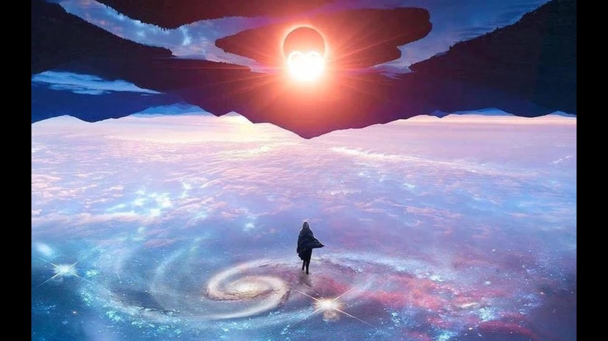

# Деятельность

Здесь я буду выкладывать музыкальные ритмы которые более детально помогут раскрыть деятельность в государстве. Но не забывайте, для женщин нужны нижние чакры, для мужчин верхние, иначе будет абсурд и не счастье. По мере возможностей я буду устранять ритмы мужчин поющих на нижних чакрах, и женщин поющих на верхних, когда найду чем заменить.



> Внимание! Возможны ошибки, но они в наименьшем количестве.

В процессе моих исследований и фиксаций, карта социализирующего ритма деятельности будет пополняться или изменяться:

>Последнее обновление: 02.11.2021

### 1. Порядок возрождения

Лозунг: где появился там и пригодился.

```diff
   1.1. Куратор романтики
        1.1.1. Дух короны = деятельность "Крайность"
               🎼 2rbina 2rista - Шестая Палата
               🎼 Enjoykin — Житие Мое
               🎼 Enjoykin — Космос Будет Наш
               🎼 Billie Eilish - bad guy
        1.1.2. Достоинство третьего глаза = деятельность "Понимание"
               🎼 Enjoykin — Я Просто Устала (feat. Марьяна Ро)
        1.1.3. Достоинство горла = деятельность "Вдохновение"
               🎼 Алексей Хворостян - Падали, но поднимались
               🎼 Буерак – Ушёл в себя
               🎼 Мот — Свадебная
               🎼 МЫ - Зима
               🎼 ЦИФЕI - Idle night
        1.1.4. Душа сердца = деятельность "Благословление"
               🎼 Celestial Healing Harmony
               🎼 Enjoykin - Группа Крови
               🎼 LOBODA — Твои Глаза
               🎼 Ляпис Трубецкой - Путинарода
               🎼 Павел Кашин - Город
               🎼 Павел Кашин - Ещё немного
        1.1.5. Регулятор солнечного сплетения = деятельность "Одиночество"
               🎼 SNEЖNO - Дэнди
        1.1.6. Честь сакральности = деятельность "Задумчивость"
               🎼 Небо Пополам - Весна
               🎼 Небо Пополам - Все будет круто!
        1.1.7. Честь корня = деятельность "Независимость"
               🎼 Сёстры - Нет дела
   1.2. Куратор справедливости
        1.2.1. Дух короны = деятельность "Отталкивание"
               🎼 DeCord - Без Жалости
               🎼 Enjoykin — Обращение к Дагестанцам
               🎼 гречка - это убило меня
               🎼 Подъем! - Хочет но не может
        1.2.2. Достоинство третьего глаза = деятельность "Отстаивание"
               🎼 Денис Майданов ВДВ
               🎼 Каста — Вокруг шум
               🎼 Каста — Они
               🎼 Каста — Прошёл через
               🎼 Коста Лакоста - Алые Водопады
               🎼 ЛУНА - Free Love
               🎼 Ногу Свело! - Наши юные смешные голоса
               🎼 Mistmorn – дідько, я у розпачі
               🎼 Marc Anthony - Flor Pálida
               🎼 Kygo - Stole The Show feat. Parson James
        1.2.3. Достоинство горла = деятельность "Напряжение"
               🎼 Empire Of The Sun - We Are The People
               🎼 СПЛИН - Романс
        1.2.4. Душа сердца = деятельность "Наблюдение"
               🎼 Enjoykin - Полковник
               🎼 леро4ка - покойник
        1.2.5. Регулятор солнечного сплетения = деятельность "Замкнутость"
               🎼 мц горемыка - не трогал твою даму
               🎼 Биполярное расстройство – Время
        1.2.6. Честь сакральности
        1.2.7. Честь корня = деятельность "Лучшее"
               🎼 Shortparis – Любовь моя будет тут
               🎼 GroTTesque - Стальное Сердце
   1.3. Куратор искренности
        1.3.1. Дух короны = деятельность "Проталкивание"
               🎼 Mind Brand (Cover by Sati Akura)
               🎼 Ани Лорак - Мы нарушаем
               🎼 Shortparis – Любовь моя будет тут
        1.3.2. Достоинство третьего глаза = деятельность "Насмешки"
               🎼 Java - J'me marre
        1.3.3. Достоинство горла = деятельность "Чёткость"
               🎼 Enjoykin — Нецветные Розы (feat. Диана Шурыгина)
               🎼 One T - I Woke Up
               🎼 RAM — Пот
        1.3.4. Душа сердца = деятельность "Суверенитет"
               🎼 IRAIDA - Ganduri
               🎼 izzamuzzic - ice
               🎼 Тибетская мантра Зеленой Тары - Исцеление от болезней. Green Tara mantra
               🎼 Anoushka Shankar - Bright Eyes ft. Alev Lenz
        1.3.5. Регулятор солнечного сплетения = деятельность "Секреты"
               🎼 Tessa Violet - Crush
        1.3.6. Честь сакральности = деятельность "Приятельство"
               🎼 Аквариум - Марш Священных Коров
               🎼 Аквариум - Пошёл Вон Вавилон
        1.3.7. Честь корня = деятельность "Отвлечение"
               🎼 Альянс - На заре
   1.4. Куратор спокойствия
        1.4.1. Дух короны = деятельность "Непривязанность"
               🎼 ТУ-134 – Память папы
               🎼 ТУ-134 – Алые цветы
        1.4.2. Достоинство третьего глаза
        1.4.3. Достоинство горла = деятельность "Бойкость"
               🎼 Как жили мы борясь - Не бойся я с тобой
        1.4.4. Душа сердца = деятельность "Предостережения"
               🎼 The xx - Together
               🎼 IC3PEAK - Плак-Плак
        1.4.5. Регулятор солнечного сплетения = деятельность "Наслаждение"
               🎼 Doja Cat - Bottom Bitch
        1.4.6. Честь сакральности = деятельность "Изящество"
               🎼 Gorillaz - Stylo
        1.4.7. Честь корня = деятельность "Подмечание"
```

### 2. Порядок блаженства

Лозунг: я работаю - ты отдыхаешь, ты работаешь - я отдыхаю.

```diff
   2.1. Куратор романтики
        2.1.1. Дух короны = деятельность "Раслабление"
               🎼 Мумий тролль - непокой
               🎼 Иванушки Int. - Тополиный пух
               🎼 Enjoykin — Писюн Писюн (feat. Ник Черников)
        2.1.2. Достоинство третьего глаза = деятельность "Приколист"
               🎼 55Х55-МУЗЫКА НЕ МУЗЫКАНТА 2 (feat. Snailkick)
               🎼 David Garrett - Viva La Vida - YouTube
               🎼 СерьГа - А что нам надо
               🎼 Карина М - Мальчик мой, порадуй
        2.1.3. Достоинство горла = деятельность "Присутствие"
               🎼 Егор Летов - ЭЛЕКТРИЧЕСКИЙ ПЁС
               🎼 Imany - You will never know
               🎼 Гражданская Оборона - Вечная весна
               🎼 Гражданская Оборона - Мы идём в тишине
               🎼 Гражданская Оборона  - Зоопарк
        2.1.4. Душа сердца = деятельность "Дом"
               🎼 Demo - Нежность
               🎼 Ava Max - Come Home
               🎼 LINDEMANN - Praise Abort
               🎼 Sufjan Stevens & Angelo De Augustine - Lady Macbeth In Chains
               🎼 Машина времени - пока горит свеча
        2.1.5. Регулятор солнечного сплетения = деятельность "Сказочность"
               🎼 Jenya Giga - Романтик
               🎼 Milky Chance - Stolen Dance
        2.1.6. Честь сакральности = деятельность "Дело"
        2.1.7. Честь корня = деятельность "Гостеприимство"
               🎼 Julien Doré - Kiss Me Forever
               🎼 Восхваление Зеленой Тары - Восхваление 21 Тары
   2.2. Куратор справедливости
        2.2.1. Дух короны = деятельность "Позволения"
               🎼 Enjoykin — Не унывайте, пацаны
               🎼 Короли ночной Вероны
        2.2.2. Достоинство третьего глаза = деятельность "Свояк"
               🎼 Enjoykin — Брат
               🎼 Shantel - DISKO PARTIZANI
               🎼 Невидимка – Звезда
        2.2.3. Достоинство горла = деятельность "Результат"
               🎼 Дискотека Авария — Небо
               🎼 Игорь Тальков — Бал сатаны
        2.2.4. Душа сердца = деятельность "Сопровождение"
               🎼 Калинов мост - Родная
        2.2.5. Регулятор солнечного сплетения = деятельность "Отвага"
               🎼 ГИО ПИКА feat. SH KERA - Владикавказ - Наш Город
        2.2.6. Честь сакральности = деятельность "Почтение"
               🎼 Enjoykin — Ламповая Няша
               🎼 MOON FAR AWAY - Velichalnaya
        2.2.7. Честь корня = деятельность "Потребности"
               🎼 Свидание - Я и твой кот
   2.3. Куратор искренности
        2.3.1. Дух короны = деятельность "Постоянность"
               🎼 Enjoykin — Лайки Крутятся (feat. Сергей Дружко)
        2.3.2. Достоинство третьего глаза = деятельность "Верность"
               🎼 Arcangel - Mi Testimonio
               🎼 Enjoykin - Семечки
        2.3.3. Достоинство горла = деятельность "Прямота"
               🎼 55x55 – СЦЕНАРИСТ (feat. BadComedian)
               🎼 Enjoykin — Котлетки с Пюрешкой
               🎼 Mujuice - Не забудем, не простим
        2.3.4. Душа сердца = деятельность "Отдаться полностью"
               🎼 Erasure - Breathe
               🎼 MANIZHA - Держи Меня Земля
        2.3.5. Регулятор солнечного сплетения = деятельность "Красота"
               🎼 Enjoykin — Алло, Кисунь
        2.3.6. Честь сакральности
        2.3.7. Честь корня = деятельность "Воспоминания"
               🎼 Смысловые Галлюцинации - Волшебный Мир
   2.4. Куратор спокойствия
        2.4.1. Дух короны = деятельность "Задумка"
               🎼 Бременские музыканты - ничего на свете лучше нету
               🎼 Пикник – Всё Перевернётся
               🎼 Фиксики - Паравозик
        2.4.2. Достоинство третьего глаза = деятельность "Праздник"
               🎼 National Youth Choir of Namibia - Endeni
               🎼 Искусство умирать – Глупая принцесса
        2.4.3. Достоинство горла = деятельность "Разрешения"
               🎼 Devendra Banhart - Carmensita
               🎼 Максим Леонидов и ХиппоБэнд - Волки
        2.4.4. Душа сердца = деятельность "Чистота"
               🎼 Enjoykin — Москва - Ленинград
        2.4.5. Регулятор солнечного сплетения = деятельность "Целостность"
               🎼 Каспийский груз - Доедешь-пиши
        2.4.6. Честь сакральности = деятельность "Доверие"
               🎼 Stupeflip - The Solution
               🎼 Вася Обломов - Жизнь налаживается
        2.4.7. Честь корня = деятельность "Требования"
               🎼 Soviet Suprem - Bolchoï
               🎼 Цой - Весь мир идет на меня войной
```

### 3. Порядок разложения

Лозунг: плохое возвращайся, хорошее прибавляйся.

```diff
   3.1. Куратор романтики
        3.1.1. Дух короны = деятельность "Неопределенность"
               🎼 Игорь Саруханов -Ты попала
        3.1.2. Достоинство третьего глаза
        3.1.3. Достоинство горла
        3.1.4. Душа сердца = деятельность "Попытка понять"
               🎼 Nю, Асия - Останься
        3.1.5. Регулятор солнечного сплетения = деятельность "Безразличие"
               🎼 Mia Rodriguez - Psycho
        3.1.6. Честь сакральности
        3.1.7. Честь корня = деятельность "Шмара"
               🎼 Скриптонит - Чистый
   3.2. Куратор справедливости
        3.2.1. Дух короны = деятельность "Внедрения"
               🎼 The Prodigy - Breathe
        3.2.2. Достоинство третьего глаза = деятельность "Пренебрежения"
               🎼 55x55 – СОЛОВЬЁБ
               🎼 CADILLAC - GAME OVER
               🎼 Enjoykin - Стартуем
               🎼 Ploho - Пустота
               🎼 План Ломоносова - Резкая как НАТЕ!
        3.2.3. Достоинство горла = деятельность "Невыполнения"
               🎼 Enjoykin — Жить По-Пацански
        3.2.4. Душа сердца = деятельность "Наступления"
               🎼 Сплин - Линия Жизни
        3.2.5. Регулятор солнечного сплетения = деятельность "Пофигизм"
               🎼 Elliot Lee - Drama Queen
        3.2.6. Честь сакральности = деятельность "Небрежность"
               🎼 Би-2 - Держаться за воздух
        3.2.7. Честь корня = деятельность "Балбес"
               🎼 Enjoykin — Nyash Myash
   3.3. Куратор искренности
        3.3.1. Дух короны
        3.3.2. Достоинство третьего глаза = деятельность "Скромность"
               🎼 Хули ты ноешь (Гимн свадебных работников, Камызяки cover)
        3.3.3. Достоинство горла = деятельность "Беспросветность"
               🎼 Enjoykin — Завтрашний День (feat. Виталий Кличко)
               🎼 Enjoykin — К Полету Готов
               🎼 Многоточие - Дыши
        3.3.4. Душа сердца
        3.3.5. Регулятор солнечного сплетения = деятельность "Непонятки"
               🎼 Emotion - Mia Rodriguez
        3.3.6. Честь сакральности = деятельность "Надежды"
               🎼 Enjoykin — Офицер
        3.3.7. Честь корня
   3.4. Куратор спокойствия
        3.4.1. Дух короны = деятельность "Отрешённость"
               🎼 Courtney Barnett - Before You Gotta Go
               🎼 Elliot Lee - Queen of Nothing
        3.4.2. Достоинство третьего глаза
               🎼 не наркоманы а растаманы мы
        3.4.3. Достоинство горла
        3.4.4. Душа сердца = деятельность "Вредные советы"
               🎼 La Caravane Passe - Nomadic Spirit ft. Mehdi Nassouli
               🎼 La Caravane Passe (feat. R.Wan) - ZINZIN MORETTO 
        3.4.5. Регулятор солнечного сплетения = деятельность "Шут"
               🎼 TOMMY CASH - RACKED
        3.4.6. Честь сакральности = деятельность "Обломы"
        3.4.7. Честь корня = деятельность "Неуклюжесть"
```

### 4. Порядок упадничества

Лозунг: я вас не знаю, и знать вас не хочу.

```diff
   4.1. Куратор романтики
        4.1.1. Дух короны = деятельность "Обвинения"
               🎼 Агата Кристи - Секрет
        4.1.2. Достоинство третьего глаза
        4.1.3. Достоинство горла = деятельность "Брожения"
               🎼 Enjoykin — Скайрим
        4.1.4. Душа сердца = деятельность "Безысходность"
               🎼 Enjoykin - Пацан к успеху шел
               🎼 Стальной дракон - Безысходность
        4.1.5. Регулятор солнечного сплетения = деятельность "Осторожность"
               🎼 ALIB - А я летаю
        4.1.6. Честь сакральности = деятельность "Отлынивания"
               🎼 Гриша - А я укуренный иду по переулочку
        4.1.7. Честь корня = деятельность "Расставания"
               🎼 Scruffpuppie - paint
               🎼 Света – А ты не мой
   4.2. Куратор справедливости
        4.2.1. Дух короны = деятельность "Презрение"
               🎼 Тони Раут x Ivan Reys - Танцуй на костях
        4.2.2. Достоинство третьего глаза = деятельность "Давление"
               🎼 9 Грамм - Ласковый зверь (при уч.Alina Orlova)
               🎼 Enjoykin - Братишка
               🎼 Grimwind - Галактика В Огне
               🎼 Oliver Tree - Cash Machine
               🎼 Без Поводка – Моя злость
               🎼 Оу74 – Кушать подано
               🎼 Путь Солнца - Руби
               🎼 Butterfly Temple - Бегу я рысью, бегу я волком
        4.2.3. Достоинство горла = деятельность "Свинство"
               🎼 Enjoykin - Безысходность
        4.2.4. Душа сердца
        4.2.5. Регулятор солнечного сплетения = деятельность "Захваты"
               🎼 Tyga - Taste ft. Offset
        4.2.6. Честь сакральности = деятельность "Изгнание"
               🎼 REDO - АЛГОРИТМЫ
        4.2.7. Честь корня = деятельность "Неразборчивость"
               🎼 Enjoykin - Crazy Midnight Display
               🎼 СЛАВА КПСС & ХАН ЗАМАЙ - МЫ РАБОТАЕМ НА КРЕМЛЬ
   4.3. Куратор искренности
        4.3.1. Дух короны = деятельность "Измена"
               🎼 Четвёртое Измерение - Фатальность
               🎼 Autoheart - I Know That He Loves Me
               🎼 Autoheart - Moscow
        4.3.2. Достоинство третьего глаза = деятельность "Болван"
               🎼 Enjoykin — Зато я спас кота (feat. Ник Черников)
               🎼 A Perfect Circle - Passive
        4.3.3. Достоинство горла = деятельность "Застой"
               🎼 Enjoykin — Дорогие Юные Друзья
               🎼 Мельница - Пусть вечерняя звезда
        4.3.4. Душа сердца = деятельность "Дура"
               🎼 Mujuice - Милый друг
        4.3.5. Регулятор солнечного сплетения = деятельность "Скупость"
               🎼 Madonna - Frozen
        4.3.6. Честь сакральности = деятельность "Ужас"
               🎼 Marilyn Manson - Tainted Love
        4.3.7. Честь корня
   4.4. Куратор спокойствия
        4.4.1. Дух короны = деятельность "Потерянность"
               🎼 Walkie - Не на той стороне
        4.4.2. Достоинство третьего глаза = деятельность "Мошенничество"
               🎼 GYPSY FOR ONE DAY - La CARAVANE PASSE feat. ERIKA SERRE
        4.4.3. Достоинство горла = деятельность "Запоздалость"
               🎼 Павел Пламенев и Евгений Егоров (гр. Эпидемия) - Сокрушить Великих
        4.4.4. Душа сердца = деятельность "Ложь"
               🎼 Enjoykin — From My Heart (feat. Виталий Мутко)
        4.4.5. Регулятор солнечного сплетения = деятельность "Ненужность"
               🎼 Александр Лаэртский – Вымирание племени
        4.4.6. Честь сакральности = деятельность "Растяпа"
               🎼 HAZИМА & Валерия – Тысячи историй
               🎼 Jason Derulo - Tip Toe feat. French Montana
        4.4.7. Честь корня = деятельность "Попадалово"
               🎼 Enjoykin - Мухи
               🎼 КУРАРА - КУРАРА ЧИБАНА
```
