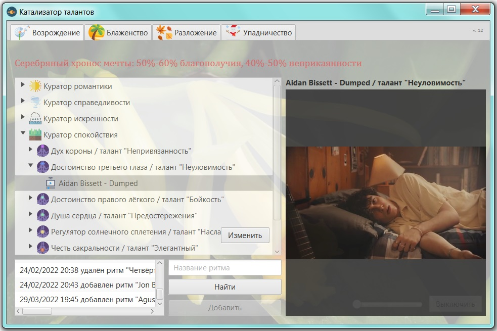

# Благоразумное благополучие

Природа это робот, только биологического формата, работающего строго по физическим законам. 

И человеку в природе не место, хотя бы потому, что природе безразлична наша чакральная система, и она никак не может помочь нам её развивать. А у нас кроме чакр, ничего примечательного то и нет. 

> Мы утеряли семейные узы и обрели идею.

Нам нужны государства, железные джунгли, которые будут реагировать на наши внутренние инструменты для парной жизни. Ведь нам надо опираться на слово "мы".


Я послойно воссоздам оптимальный жизненный путь, необходимый для выживания, как для женского тела, так и мужского. 

---------------------------

### Проект "Катализатор талантов"

Музыка вдохновлённая Временем: <a href="./Катализатор талантов_v12.zip">12 версия</a> (без видео-файлов - нужно вручную добавлять).



Ниже я буду расширять музыкальные ритмы которые более детально помогут возродить таланты для государства или создать само государство. Но не забывайте, для женщин нужны нижние чакры, для мужчин верхние, иначе будет абсурд и несчастье. По мере возможностей я буду устранять ритмы мужчин поющих на нижних чакрах, и женщин поющих на верхних, когда найду чем заменить. Для чакры солнечного сплетения пол не важен.


> Внимание! Возможны ошибки, но они в наименьшем количестве.

В процессе моих исследований и фиксаций, карта социализирующего ритма деятельности будет пополняться или изменяться:

>Последнее обновление: 11.07.2022

### 1. Порядок возрождения

> Отвечает за создание семьи.

Лозунг: где появился там и пригодился.

```diff
1.1. Куратор романтики
        1.1.1. Дух короны = талант "Крайность"
               🎼 2rbina 2rista - Шестая Палата
               🎼 Enjoykin — Житие Мое
               🎼 Enjoykin — Космос Будет Наш
               🎼 Billie Eilish - bad guy
               🎼 Jubilee - BRNNNG
        1.1.2. Достоинство третьего глаза = талант "Понимание"
               🎼 Enjoykin — Я Просто Устала (feat. Марьяна Ро)
        1.1.3. Достоинство горла = талант "Вдохновение"
               🎼 Алексей Хворостян - Падали, но поднимались
               🎼 Буерак – Ушёл в себя
               🎼 Мот — Свадебная
               🎼 МЫ - Зима
               🎼 ЦИФЕI - Idle night
        1.1.4. Душа сердца = талант "Благословление"
               🎼 Celestial Healing Harmony
               🎼 Enjoykin - Группа Крови
               🎼 LOBODA — Твои Глаза
               🎼 Ляпис Трубецкой - Путинарода
               🎼 Павел Кашин - Город
               🎼 Павел Кашин - Ещё немного
        1.1.5. Регулятор солнечного сплетения = талант "Одиночество"
               🎼 SNEЖNO - Дэнди
        1.1.6. Честь сакральности = талант "Задумчивость"
               🎼 Небо Пополам - Весна
               🎼 Небо Пополам - Все будет круто!
        1.1.7. Честь корня = талант "Независимость"
               🎼 Сёстры - Нет дела
   1.2. Куратор справедливости
        1.2.1. Дух короны = талант "Отталкивание"
               🎼 DeCord - Без Жалости
               🎼 Enjoykin — Обращение к Дагестанцам
               🎼 гречка - это убило меня
               🎼 Подъем! - Хочет но не может
        1.2.2. Достоинство третьего глаза = талант "Отстаивание"
               🎼 Денис Майданов ВДВ
               🎼 Каста — Вокруг шум
               🎼 Каста — Прошёл через
               🎼 Коста Лакоста - Алые Водопады
               🎼 ЛУНА - Free Love
               🎼 Ногу Свело! - Наши юные смешные голоса
               🎼 Mistmorn – дідько, я у розпачі
               🎼 Marc Anthony - Flor Pálida
               🎼 Kygo - Stole The Show feat. Parson James
               🎼 гр.ГороД - Дождь
        1.2.3. Достоинство горла = талант "Напряжение"
               🎼 Empire Of The Sun - We Are The People
               🎼 СПЛИН - Романс
        1.2.4. Душа сердца = талант "Наблюдение"
               🎼 Enjoykin - Полковник
               🎼 леро4ка - покойник
        1.2.5. Регулятор солнечного сплетения = талант "Замкнутость"
               🎼 мц горемыка - не трогал твою даму
               🎼 Биполярное расстройство – Время
        1.2.6. Честь сакральности = талант "Отрыв"
               🎼 Даня Милохин - Не догонят
               🎼 Тату - Я Твоя Не Первая
        1.2.7. Честь корня = талант "Лучшее"
               🎼 El Alfa - Mera Woo
               🎼 GroTTesque - Стальное Сердце
   1.3. Куратор искренности
        1.3.1. Дух короны = талант "Проталкивание"
               🎼 Mind Brand (Cover by Sati Akura)
               🎼 Ани Лорак - Мы нарушаем
               🎼 Shortparis – Любовь моя будет тут
               🎼 T-Fest - Улети
               🎼 Псой Короленко - Я - Штирлиц
        1.3.2. Достоинство третьего глаза = талант "Насмешки"
               🎼 Java - J'me marre
               🎼 The Baseballs - Rock me Amadeus
        1.3.3. Достоинство горла = талант "Чёткость"
               🎼 Enjoykin — Нецветные Розы (feat. Диана Шурыгина)
               🎼 One T - I Woke Up
               🎼 RAM — Пот
               🎼 Танцы Минус - Половинка
               🎼 ГРЯЗНЫЙ РАМИРЕС — MAGNITUDE
        1.3.4. Душа сердца = талант "Суверенитет"
               🎼 IRAIDA - Ganduri
               🎼 izzamuzzic - ice
               🎼 Тибетская мантра Зеленой Тары - Исцеление от болезней. Green Tara mantra
               🎼 Anoushka Shankar - Bright Eyes ft. Alev Lenz
        1.3.5. Регулятор солнечного сплетения = талант "Секреты"
               🎼 Tessa Violet - Crush
        1.3.6. Честь сакральности = талант "Приятельство"
               🎼 Аквариум - Марш Священных Коров
               🎼 Аквариум - Пошёл Вон Вавилон
        1.3.7. Честь корня = талант "Отвлечение"
               🎼 Альянс - На заре
   1.4. Куратор спокойствия
        1.4.1. Дух короны = талант "Непривязанность"
               🎼 ТУ-134 – Память папы
               🎼 ТУ-134 – Алые цветы
        1.4.2. Достоинство третьего глаза = талант "Неуловимость"
               🎼 Aidan Bissett - Dumped
        1.4.3. Достоинство горла = талант "Бойкость"
               🎼 Как жили мы борясь - Не бойся я с тобой
        1.4.4. Душа сердца = талант "Предостережения"
               🎼 The xx - Together
               🎼 IC3PEAK - Плак-Плак
        1.4.5. Регулятор солнечного сплетения = талант "Наслаждение"
               🎼 Doja Cat - Bottom Bitch
        1.4.6. Честь сакральности = талант "Элегантный"
               🎼 Gorillaz - Stylo
        1.4.7. Честь корня = талант "Подмечание"
               🎼 Где Фантом? - Я тебя люблю
```

### 2. Порядок блаженства

> Отвечает за рождение детей.

Лозунг: я работаю - ты отдыхаешь, ты работаешь - я отдыхаю.

```diff
   2.1. Куратор романтики
        2.1.1. Дух короны = талант "Раслабление"
               🎼 Мумий тролль - непокой
               🎼 Иванушки Int. - Тополиный пух
               🎼 Enjoykin — Писюн Писюн (feat. Ник Черников)
               🎼 9 район - Бегом из детства
               🎼 Gogol Bordello - Wonderlust King
               🎼 Андрей Бандера - А помнишь
               🎼 Bloo - I am
        2.1.2. Достоинство третьего глаза = талант "Приколист"
               🎼 55Х55-МУЗЫКА НЕ МУЗЫКАНТА 2 (feat. Snailkick)
               🎼 David Garrett - Viva La Vida - YouTube
               🎼 СерьГа - А что нам надо
               🎼 Карина М - Мальчик мой, порадуй
        2.1.3. Достоинство горла = талант "Присутствие"
               🎼 Егор Летов - ЭЛЕКТРИЧЕСКИЙ ПЁС
               🎼 Imany - You will never know
               🎼 Гражданская Оборона - Вечная весна
               🎼 Гражданская Оборона - Мы идём в тишине
               🎼 Гражданская Оборона  - Зоопарк
        2.1.4. Душа сердца = талант "Уют"
               🎼 Demo - Нежность
               🎼 Ava Max - Come Home
               🎼 LINDEMANN - Praise Abort
               🎼 Sufjan Stevens & Angelo De Augustine - Lady Macbeth In Chains
               🎼 Машина времени - пока горит свеча
               🎼 Рада Рай - Не суди меня, любимый
               🎼 DPR IAN - So Beautiful
               🎼 DPR LIVE - Yellow Cab
        2.1.5. Регулятор солнечного сплетения = талант "Потеха"
               🎼 Jenya Giga - Романтик
               🎼 Milky Chance - Stolen Dance
               🎼 Захар Май - Я посылаю все нахуй
               🎼 Аркадий Укупник - Ресторанчик-Поплавок
        2.1.6. Честь сакральности = талант "Дело"
               🎼 GIRLI – I Don’t Like Myself
        2.1.7. Честь корня = талант "Гостеприимство"
               🎼 Julien Doré - Kiss Me Forever
               🎼 Восхваление Зеленой Тары - Восхваление 21 Тары
   2.2. Куратор справедливости
        2.2.1. Дух короны = талант "Позволения"
               🎼 Enjoykin — Не унывайте, пацаны
               🎼 Короли ночной Вероны
               🎼 Воплі Відоплясова - Весна
               🎼 Макс Барских — Неверная
               🎼 Milen - Такая растакая
        2.2.2. Достоинство третьего глаза = талант "Свояк"
               🎼 Enjoykin — Брат
               🎼 Shantel - DISKO PARTIZANI
               🎼 Невидимка – Звезда
        2.2.3. Достоинство горла = талант "Результат"
               🎼 Дискотека Авария — Небо
               🎼 Игорь Тальков — Бал сатаны
               🎼 Agustin Ramos - Maria, mi vida, mi amor
        2.2.4. Душа сердца = талант "Сопровождение"
               🎼 Калинов мост - Родная
        2.2.5. Регулятор солнечного сплетения = талант "Отвага"
               🎼 ГИО ПИКА feat. SH KERA - Владикавказ - Наш Город
        2.2.6. Честь сакральности = талант "Почтение"
               🎼 Enjoykin — Ламповая Няша
               🎼 MOON FAR AWAY - Velichalnaya
        2.2.7. Честь корня = талант "Потребности"
               🎼 Свидание - Я и твой кот
   2.3. Куратор искренности
        2.3.1. Дух короны = талант "Постоянность"
               🎼 Enjoykin — Лайки Крутятся (feat. Сергей Дружко)
        2.3.2. Достоинство третьего глаза = талант "Верность"
               🎼 Arcangel - Mi Testimonio
               🎼 Enjoykin - Семечки
        2.3.3. Достоинство горла = талант "Прямота"
               🎼 55x55 – СЦЕНАРИСТ (feat. BadComedian)
               🎼 Enjoykin — Котлетки с Пюрешкой
               🎼 Mujuice - Не забудем, не простим
        2.3.4. Душа сердца = талант "Отдаться полностью"
               🎼 Erasure - Breathe
               🎼 MANIZHA - Держи Меня Земля
        2.3.5. Регулятор солнечного сплетения = талант "Красота"
               🎼 Enjoykin — Алло, Кисунь
        2.3.6. Честь сакральности
        2.3.7. Честь корня = талант "Воспоминания"
               🎼 Смысловые Галлюцинации - Волшебный Мир
   2.4. Куратор спокойствия
        2.4.1. Дух короны = талант "Задумка"
               🎼 Бременские музыканты - ничего на свете лучше нету
               🎼 Пикник – Всё Перевернётся
               🎼 Фиксики - Паравозик
        2.4.2. Достоинство третьего глаза = талант "Праздник"
               🎼 National Youth Choir of Namibia - Endeni
               🎼 Искусство умирать – Глупая принцесса
        2.4.3. Достоинство горла = талант "Разрешения"
               🎼 Devendra Banhart - Carmensita
               🎼 Максим Леонидов и ХиппоБэнд - Волки
        2.4.4. Душа сердца = талант "Чистота"
               🎼 Enjoykin — Москва - Ленинград
               🎼 Dan Balan - Любовь как в песнях
        2.4.5. Регулятор солнечного сплетения = талант "Целостность"
               🎼 Каспийский груз - Доедешь-пиши
        2.4.6. Честь сакральности = талант "Верность"
               🎼 Stupeflip - The Solution
               🎼 Вася Обломов - Жизнь налаживается
               🎼 Iamnotshane - Don't Say That
        2.4.7. Честь корня = талант "Требования"
               🎼 Soviet Suprem - Bolchoï
               🎼 Цой - Весь мир идет на меня войной
```

### 3. Порядок разложения

> Отвечает за помощь от родственников.

Лозунг: плохое возвращайся, хорошее прибавляйся.

```diff
   3.1. Куратор романтики
        3.1.1. Дух короны = талант "Неопределенность"
               🎼 Игорь Саруханов -Ты попала
        3.1.2. Достоинство третьего глаза
        3.1.3. Достоинство горла
        3.1.4. Душа сердца = талант "Попытка понять"
               🎼 Nю, Асия - Останься
        3.1.5. Регулятор солнечного сплетения = талант "Безразличие"
               🎼 Mia Rodriguez - Psycho
        3.1.6. Честь сакральности
        3.1.7. Честь корня = талант "Шмара"
               🎼 Скриптонит - Чистый
   3.2. Куратор справедливости
        3.2.1. Дух короны = талант "Внедрения"
               🎼 The Prodigy - Breathe
        3.2.2. Достоинство третьего глаза = талант "Пренебрежения"
               🎼 55x55 – СОЛОВЬЁБ
               🎼 CADILLAC - GAME OVER
               🎼 Enjoykin - Стартуем
               🎼 Ploho - Пустота
               🎼 План Ломоносова - Резкая как НАТЕ!
        3.2.3. Достоинство горла = талант "Невыполнения"
               🎼 Enjoykin — Жить По-Пацански
        3.2.4. Душа сердца = талант "Наступления"
               🎼 Сплин - Линия Жизни
        3.2.5. Регулятор солнечного сплетения = талант "Пофигизм"
               🎼 Elliot Lee - Drama Queen
        3.2.6. Честь сакральности = талант "Небрежность"
               🎼 Би-2 - Держаться за воздух
        3.2.7. Честь корня = талант "Балбес"
               🎼 Enjoykin — Nyash Myash
   3.3. Куратор искренности
        3.3.1. Дух короны
        3.3.2. Достоинство третьего глаза = талант "Скромность"
               🎼 Хули ты ноешь (Гимн свадебных работников, Камызяки cover)
        3.3.3. Достоинство горла = талант "Беспросветность"
               🎼 Enjoykin — Завтрашний День (feat. Виталий Кличко)
               🎼 Enjoykin — К Полету Готов
               🎼 Многоточие - Дыши
        3.3.4. Душа сердца
        3.3.5. Регулятор солнечного сплетения = талант "Непонятки"
               🎼 Emotion - Mia Rodriguez
        3.3.6. Честь сакральности = талант "Надежды"
               🎼 Enjoykin — Офицер
        3.3.7. Честь корня
   3.4. Куратор спокойствия
        3.4.1. Дух короны = талант "Отрешённость"
               🎼 Courtney Barnett - Before You Gotta Go
               🎼 Elliot Lee - Queen of Nothing
        3.4.2. Достоинство третьего глаза
               🎼 не наркоманы а растаманы мы
        3.4.3. Достоинство горла
        3.4.4. Душа сердца = талант "Вредные советы"
               🎼 La Caravane Passe - Nomadic Spirit ft. Mehdi Nassouli
               🎼 La Caravane Passe (feat. R.Wan) - ZINZIN MORETTO 
        3.4.5. Регулятор солнечного сплетения = талант "Шут"
               🎼 TOMMY CASH - RACKED
        3.4.6. Честь сакральности = талант "Обломы"
        3.4.7. Честь корня = талант "Неуклюжесть"
```

### 4. Порядок упадничества

> Отвечает за самостоятельность.

Лозунг: я вас не знаю, и знать вас не хочу.

```diff
   4.1. Куратор романтики
        4.1.1. Дух короны = талант "Обвинения"
               🎼 Агата Кристи - Секрет
               🎼 Максим Фадеев - Ну, Вот И Всё
               🎼 Максим Фадеев - Беги По Небу
        4.1.2. Достоинство третьего глаза
               🎼 Елена Фролова - Разлука смотрит на меня...
        4.1.3. Достоинство горла = талант "Брожения"
               🎼 Enjoykin — Скайрим
        4.1.4. Душа сердца = талант "Безысходность"
               🎼 Enjoykin - Пацан к успеху шел
               🎼 Стальной дракон - Безысходность
        4.1.5. Регулятор солнечного сплетения = талант "Осторожность"
               🎼 ALIB - А я летаю
        4.1.6. Честь сакральности = талант "Отлынивания"
               🎼 Гриша - А я укуренный иду по переулочку
        4.1.7. Честь корня = талант "Расставания"
               🎼 Scruffpuppie - paint
               🎼 Света – А ты не мой
               🎼 Небо над головой - Кто сказал, что будет легко
   4.2. Куратор справедливости
        4.2.1. Дух короны = талант "Презрение"
               🎼 Тони Раут x Ivan Reys - Танцуй на костях
               🎼 Easy life - Have a great day
               🎼 NILETTO, BITTUEV - Быть собой
        4.2.2. Достоинство третьего глаза = талант "Давление"
               🎼 9 Грамм - Ласковый зверь (при уч.Alina Orlova)
               🎼 Enjoykin - Братишка
               🎼 Grimwind - Галактика В Огне
               🎼 Oliver Tree - Cash Machine
               🎼 Без Поводка – Моя злость
               🎼 Оу74 – Кушать подано
               🎼 Путь Солнца - Руби
               🎼 Butterfly Temple - Бегу я рысью, бегу я волком
        4.2.3. Достоинство горла = талант "Свинство"
               🎼 Enjoykin - Безысходность
        4.2.4. Душа сердца
        4.2.5. Регулятор солнечного сплетения = талант "Захваты"
               🎼 Tyga - Taste ft. Offset
        4.2.6. Честь сакральности = талант "Изгнание"
               🎼 REDO - АЛГОРИТМЫ
        4.2.7. Честь корня = талант "Неразборчивость"
               🎼 Enjoykin - Crazy Midnight Display
               🎼 СЛАВА КПСС & ХАН ЗАМАЙ - МЫ РАБОТАЕМ НА КРЕМЛЬ
   4.3. Куратор искренности
        4.3.1. Дух короны = талант "Удерживание"
               🎼 Autoheart - I Know That He Loves Me
               🎼 Autoheart - Moscow
               🎼 Dabro - Услышит весь район
               🎼 Jon Batiste - FREEDOM
        4.3.2. Достоинство третьего глаза = талант "Болван"
               🎼 Enjoykin — Зато я спас кота (feat. Ник Черников)
               🎼 A Perfect Circle - Passive
        4.3.3. Достоинство горла = талант "Застой"
               🎼 Enjoykin — Дорогие Юные Друзья
               🎼 Мельница - Пусть вечерняя звезда
        4.3.4. Душа сердца = талант "Дура"
               🎼 Mujuice - Милый друг
        4.3.5. Регулятор солнечного сплетения = талант "Скупость"
               🎼 Madonna - Frozen
        4.3.6. Честь сакральности = талант "Ужас"
               🎼 Marilyn Manson - Tainted Love
        4.3.7. Честь корня = талант "Отброс"
               🎼 Röyksopp - What Else Is There?
   4.4. Куратор спокойствия
        4.4.1. Дух короны = талант "Потерянность"
               🎼 Walkie - Не на той стороне
        4.4.2. Достоинство третьего глаза = талант "Мошенничество"
               🎼 GYPSY FOR ONE DAY - La CARAVANE PASSE feat. ERIKA SERRE
        4.4.3. Достоинство горла = талант "Запоздалость"
               🎼 Павел Пламенев и Евгений Егоров (гр. Эпидемия) - Сокрушить Великих
        4.4.4. Душа сердца = талант "Ложь"
               🎼 Enjoykin — From My Heart (feat. Виталий Мутко)
        4.4.5. Регулятор солнечного сплетения = талант "Ненужность"
               🎼 Александр Лаэртский – Вымирание племени
               🎼 Imstorie - Москва
        4.4.6. Честь сакральности = талант "Растяпа"
               🎼 HAZИМА & Валерия – Тысячи историй
               🎼 Jason Derulo - Tip Toe feat. French Montana
        4.4.7. Честь корня = талант "Попадалово"
               🎼 Enjoykin - Мухи
               🎼 КУРАРА - КУРАРА ЧИБАНА
```
