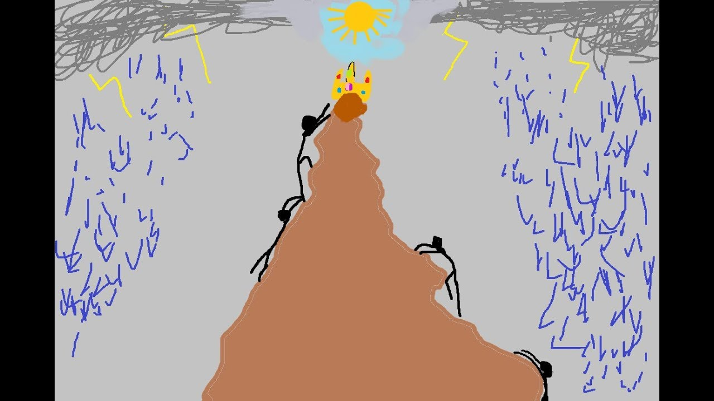

# Благоразумная колыбель

Природа это робот, только биологического формата, работающего строго по физическим законам. 

И человеку в природе не место, хотя бы потому, что природе безразлична наша чакральная система, и она никак не может помочь нам её развивать. А у нас кроме чакр, ничего примечательного то и нет. 

> Мы утеряли семейные узы и обрели идею.

Нам нужны государства, железные джунгли, которые будут реагировать на наши внутренние инструменты для парной жизни. Ведь нам надо опираться на слово "мы".


Я послойно воссоздам оптимальный жизненный путь, необходимый для выживания, как для женского тела, так и мужского. 

---------------------------

### Проект "Места силы"

Я к сожалению не так богат, чтобы поездить по местам силы, и могу лишь составить карту по косвенным данным (снять информацию от тех, кто там был и возвратился). 



> Внимание! Возможны ошибки, но они в наименьшем количестве.

В процессе моих исследований и фиксаций, карта привилегий для чакр будет пополняться или изменяться:

>Последнее обновление: 02.11.2021

### 1. Куратор романтики

```diff
   1.1. Дух короны = привилегия границ
   1.2. Достоинство третьего глаза = привилегия наблюдения
   1.3. Достоинство правого лёгкого = привилегия движений
   1.4. Душа сердца = привилегия присутствий
   1.5. Регулятор солнечного сплетения = царь привилегия ошалелости
   1.6. Честь сакральности = привилегия погружений
   1.7. Честь корня = привилегия занятости
```

### 2. Куратор справедливости

```diff
   1.1. Дух короны = ?
   1.2. Достоинство третьего глаза = ?
   1.3. Достоинство правого лёгкого = ?
   1.4. Душа сердца = ?
   1.5. Регулятор солнечного сплетения = царь привилегия самоволки
   1.6. Честь сакральности = ?
   1.7. Честь корня = ?
```

### 3. Куратор искренности

```diff
   1.1. Дух короны = привилегия солидности
   1.2. Достоинство третьего глаза = ?
   1.3. Достоинство правого лёгкого = ?
   1.4. Душа сердца = ?
   1.5. Регулятор солнечного сплетения = царь привилегия изящества
   1.6. Честь сакральности = ?
   1.7. Честь корня = ?
```

### 4. Куратор спокойствия

```diff
   1.1. Дух короны = ?
   1.2. Достоинство третьего глаза = ?
   1.3. Достоинство правого лёгкого = ?
   1.4. Душа сердца = ?
   1.5. Регулятор солнечного сплетения = царь привилегия контроля
   1.6. Честь сакральности = ?
   1.7. Честь корня = ?
```