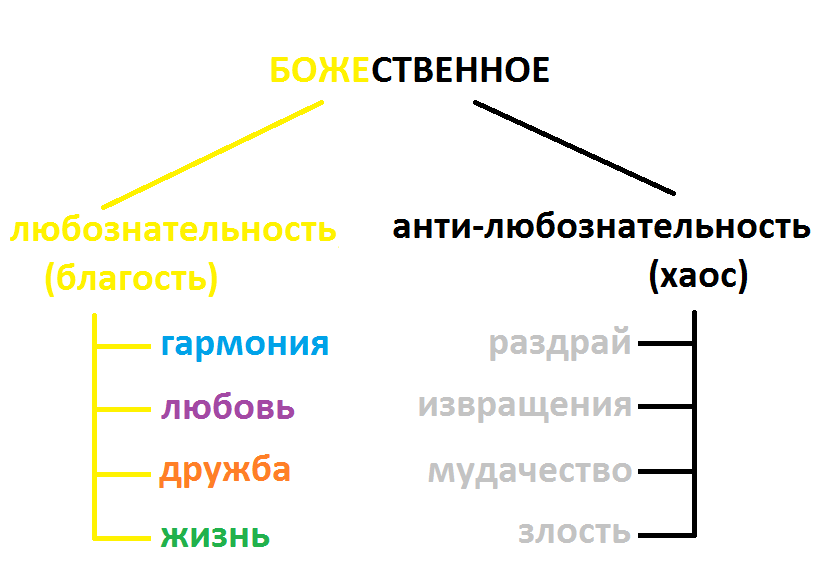

# Размышления

Почти что не сохранилось информации от прошлых размышлений, лишь некоторые файлы..

### Подход

Выявил две социальные опоры:
1. дипломатия, опора на людей
2. тотальность, опора на законы мироздания.

### Божественное

Попытался вписать плохое положение дел в естественный ход порядка. Это неверный ход оказался. Капля дёгтя.

### Человек и эпифиз

Выявил что шишковидная железа (эпифиз) и на самом деле важный элемент, хотя было время когда я считал его инородным, как контроль над человечеством. На деле это наш орган, чакра третьего глаза, побуждающая интерес жить следующим днём. Деньги должны были запитываться такой энергией на уровне государства (но сейчас наоборот, через деньги государство снимает эту энергии с населения). 

### Четыре рассы

Здесь я попытался изучить момент того, что нас объединяет. Я опирался на прошлые рассы. На деле я изучал чакру солнечного сплетения.

